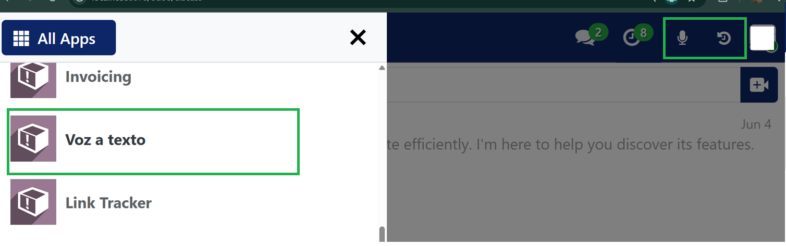
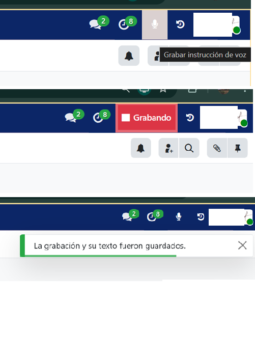
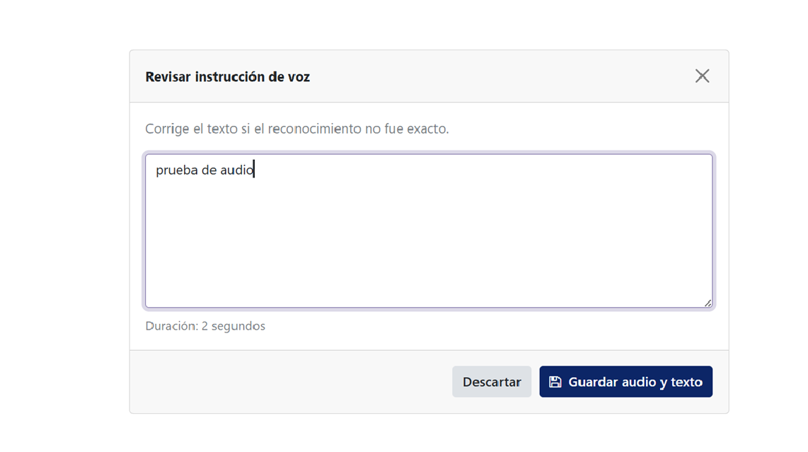
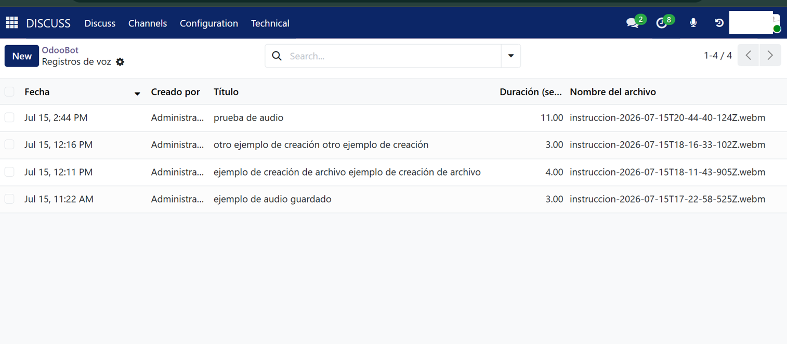
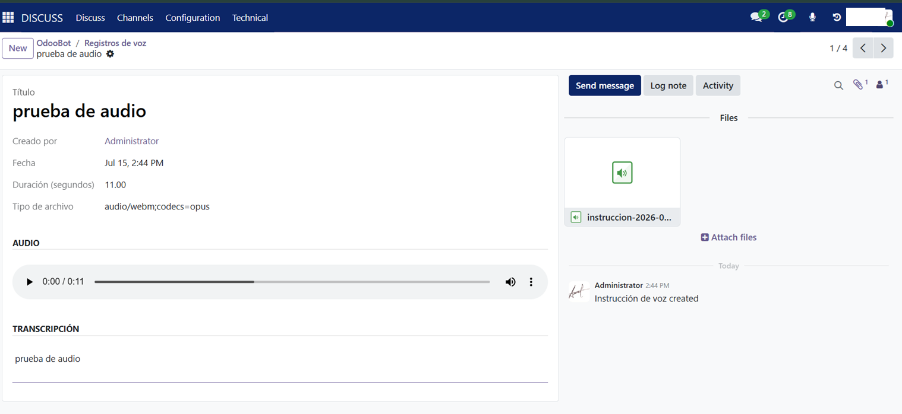

# 🎤 Voice-to-Text for Odoo 19

An Odoo 19 module that records audio from the user's microphone and converts speech into text using the browser's Web Speech API.

The module stores the audio recording, transcription, recording duration, and the user who created it.

---

## Features

- 🎙️ Record audio directly from the browser
- 📝 Automatic speech-to-text transcription
- 👤 Store the user who created the recording
- ⏱️ Save recording duration
- 💾 Store audio files in Odoo
- 🔍 View transcription history

---

## Screenshots

### Bar View

### Recording Audio

### Generated Transcription

### History

### Record Details

---

## Technologies

- Odoo 19
- Python
- JavaScript
- HTML/CSS
- Web Speech API
